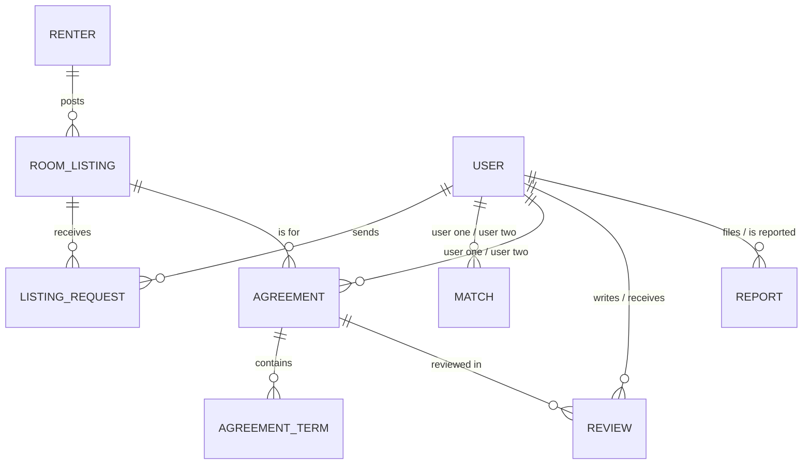

# Rifqa (رفقة) – Roommate Matching API

Rifqa is a Spring Boot REST API that helps people find compatible roommates. Users create a lifestyle profile and get an AI-suggested roommate from people looking in the same city. Renters post room listings that users can request to join. Roommates can then write a shared agreement with house rules, review each other when it ends, and report bad behavior to admins.

> Individual capstone project (Capstone 2).

---

## Table of Contents
- [Features](#features)
- [Tech Stack](#tech-stack)
- [Project Structure](#project-structure)
- [Data Model](#data-model)
- [Business Rules](#business-rules)
- [AI Matching](#ai-matching)
- [Email Notifications](#email-notifications)
- [API Endpoints](#api-endpoints)
- [Error Handling](#error-handling)
- [Getting Started](#getting-started)
- [Example Requests](#example-requests)
- [Future Improvements](#future-improvements)

---

## Features

- **User profiles** with lifestyle details: budget, sleep schedule, cleanliness level, smoking, pets, visitors, occupation and bio.
- **AI roommate matching**: suggests the most compatible roommate with a compatibility score (0–100) and a short explanation.
- **Room listings** posted by renters, searchable by city and maximum rent.
- **Listing requests**: users request to join a listing, and the owner accepts or rejects it.
- **Agreements** between two roommates with a lifecycle (`DRAFT → ACTIVE → TERMINATED`) and editable house rules (terms).
- **Reviews** (1–5 stars) after an agreement ends, plus a user's average rating.
- **Reports** against users, handled by admins.
- **Admin tools**: verify users and renters, review or dismiss reports.
- **Email notifications** when a request is accepted or a match is confirmed.

---

## Tech Stack

| Layer | Technology |
|---|---|
| Language | Java 17 |
| Framework | Spring Boot 4.1.1 (Spring 7) |
| Persistence | Spring Data JPA, Hibernate 7, MySQL |
| Validation | Jakarta Bean Validation |
| JSON | Jackson 3 (`tools.jackson.*`) |
| Email | Spring Mail (Gmail SMTP) |
| AI | OpenAI-compatible Chat Completions API (`gpt-4o-mini`) via `RestTemplate` |
| Utilities | Lombok |
| Testing | Postman |

---

## Project Structure

```
com.example.capstone2rifqa
├── Api          ApiException, ApiResponse, ControllerAdvice
├── Controller   REST controllers (10)
├── DTO          MatchSuggestion
├── Entity       JPA entities (10) and enums (5)
├── Repository   Spring Data JPA repositories
└── Service      Business logic, AiService, EmailService
```

The code follows a layered design: **Controller → Service → Repository**. Controllers only receive requests and return responses; all validation and business rules live in the services.

---

## Data Model

### Entities

| Entity | Description |
|---|---|
| `User` | A person looking for a roommate, with a lifestyle profile |
| `Renter` | A person who owns rooms and posts listings |
| `Admin` | Platform moderator |
| `RoomListing` | A room posted by a renter |
| `ListingRequest` | A user's request to join a room listing |
| `Match` | A confirmed pairing between two users, with an AI score and reasoning |
| `Agreement` | A roommate agreement between two users for a listing |
| `AgreementTerm` | A house rule inside an agreement |
| `Review` | A rating one roommate gives the other after an agreement |
| `Report` | A complaint filed by one user against another |

### Enums

| Enum | Values |
|---|---|
| `UserStatus` | `LOOKING`, `MATCHED`, `NOT_LOOKING` |
| `SleepSchedule` | `EARLY_BIRD`, `NIGHT_OWL` |
| `RequestStatus` | `PENDING`, `ACCEPTED`, `REJECTED` |
| `AgreementStatus` | `DRAFT`, `ACTIVE`, `TERMINATED` |
| `ReportStatus` | `PENDING`, `REVIEWED`, `DISMISSED` |

### Relationships

Relations are stored as plain `Integer` foreign-key fields (for example `renterId`, `listingId`).



---

## Business Rules

**Users and renters**
- Emails are unique.
- New users start as `LOOKING` and unverified. New renters start unverified.
- Only an admin can verify a user or renter, and a verified account cannot be verified again.
- Passwords are write-only: they are accepted in requests but never returned in responses.

**Room listings and requests**
- A listing can only be created for an existing renter, and it starts as available.
- A user can send only one request per listing, and only to an available listing.
- A request can only be edited while `PENDING` (message only).
- Only the listing's owner can accept or reject a request, and only while it is `PENDING`.
- Accepting a request emails the user with the renter's contact details.

**Matching**
- Only users with status `LOOKING` can get suggestions.
- Candidates are `LOOKING` users in the same city with the same gender.
- Suggesting a match saves nothing. Confirming a match saves it, sets both users to `MATCHED`, and emails both.
- The same two users cannot be matched twice (checked in both orders).
- Deleting a match sets both users back to `LOOKING`.

**Agreements and terms**
- An agreement must be between two different existing users, for an existing listing, and the end date must be after the start date.
- Status flow: `DRAFT → ACTIVE → TERMINATED`.
- An agreement can only be edited or deleted while `DRAFT`. Deleting it also deletes its terms.
- Terms (house rules) can only be added, edited or deleted while the agreement is `DRAFT`. They are locked once it becomes active.

**Reviews**
- Reviews are allowed only after the agreement is `TERMINATED`.
- Both the reviewer and the reviewed user must be part of the agreement, and users cannot review themselves.
- One review per reviewer per agreement.
- The average rating is `0.0` when a user has no reviews.

**Reports**
- Users cannot report themselves.
- A report can only be edited (reason only) while `PENDING`.
- Only an admin can change a report's status, from `PENDING` to `REVIEWED` or `DISMISSED`, and only once.

---

## AI Matching

`GET /api/v1/match/suggest/{userId}`

1. The service loads the user and up to 50 candidates (same city, same gender, `LOOKING`).
2. `AiService` sends a prompt to an OpenAI-compatible chat API asking for the single most compatible candidate in JSON format.
3. The response is parsed into a `MatchSuggestion`. The score is kept between 0 and 100 and the reasoning is cut to 1000 characters to fit the database.
4. The service checks that the AI picked someone who was actually in the candidate list.
5. The suggestion is returned to the user. If they approve it, the client calls `POST /api/v1/match/confirm` to save it.

**Privacy:** only lifestyle fields (age, occupation, budget, smoker, pets, visitors, cleanliness, sleep schedule, bio) are sent to the AI. Names, emails, phone numbers and passwords never leave the server.

Example response:

```json
{
  "userId": 1,
  "suggestedUserId": 4,
  "suggestedUserName": "Sara",
  "compatibilityScore": 87.0,
  "aiReasoning": "Both are early birds with similar budgets and high cleanliness levels. Neither smokes, and both prefer few visitors."
}
```

---

## Email Notifications

| Trigger | Recipient | Content |
|---|---|---|
| Listing request accepted | The requester | Listing details and the renter's name and phone number |
| Match confirmed | Both users | Roommate's name, phone number and compatibility score |

If an email fails to send, the error is logged and the main action (accepting the request or confirming the match) still succeeds.

---

## API Endpoints

Base URL: `http://localhost:8080/api/v1`

**73 endpoints** across 10 controllers.

### User – `/user`
| Method | Endpoint | Description |
|---|---|---|
| GET | `/get` | Get all users |
| GET | `/get/{id}` | Get user by ID |
| GET | `/get-by-city/{city}` | Get users in a city |
| GET | `/get-by-status/{status}` | Get users by status (case-insensitive) |
| POST | `/add` | Register a user |
| PUT | `/update/{id}` | Update a user |
| DELETE | `/delete/{id}` | Delete a user |

### Renter – `/renter`
| Method | Endpoint | Description |
|---|---|---|
| GET | `/get` | Get all renters |
| GET | `/get/{id}` | Get renter by ID |
| POST | `/add` | Register a renter |
| PUT | `/update/{id}` | Update a renter |
| DELETE | `/delete/{id}` | Delete a renter |

### Admin – `/admin`
| Method | Endpoint | Description |
|---|---|---|
| GET | `/get` | Get all admins |
| GET | `/get/{id}` | Get admin by ID |
| POST | `/add` | Add an admin |
| PUT | `/verify-user/adminid/{adminId}/userid/{userId}` | Verify a user |
| PUT | `/verify-renter/adminid/{adminId}/renterid/{renterId}` | Verify a renter |
| PUT | `/update-report-status/adminid/{adminId}/reportid/{reportId}/status/{status}` | Mark a report `REVIEWED` or `DISMISSED` |

### Room Listing – `/room-listing`
| Method | Endpoint | Description |
|---|---|---|
| GET | `/get` | Get all listings |
| GET | `/get/{id}` | Get listing by ID |
| GET | `/get-by-renter/{renterId}` | Get a renter's listings |
| GET | `/get-available-by-city/{city}` | Available listings in a city |
| GET | `/get-available-by-max-rent/{maxRent}` | Available listings up to a rent, cheapest first |
| POST | `/add` | Add a listing |
| PUT | `/update/{id}` | Update a listing |
| PUT | `/toggle-availability/{id}` | Switch a listing between available and not available |
| DELETE | `/delete/{id}` | Delete a listing |

### Listing Request – `/listing-request`
| Method | Endpoint | Description |
|---|---|---|
| GET | `/get` | Get all requests |
| GET | `/get/{id}` | Get request by ID |
| GET | `/get-by-listing/{listingId}` | Requests for a listing |
| GET | `/get-pending-by-listing/{listingId}` | Pending requests for a listing |
| GET | `/get-by-requester/{requesterId}` | Requests sent by a user |
| POST | `/add` | Send a request |
| PUT | `/update/{id}` | Edit the message (pending only) |
| PUT | `/accept/requestid/{requestId}/renterid/{renterId}` | Accept a request (owner only, sends email) |
| PUT | `/reject/requestid/{requestId}/renterid/{renterId}` | Reject a request (owner only) |
| DELETE | `/delete/{id}` | Delete a request |

### Match – `/match`
| Method | Endpoint | Description |
|---|---|---|
| GET | `/get` | Get all matches |
| GET | `/get/{id}` | Get match by ID |
| GET | `/get-by-user/{userId}` | Get a user's matches |
| GET | `/suggest/{userId}` | AI roommate suggestion (nothing saved) |
| POST | `/confirm` | Confirm and save a match (sends emails) |
| DELETE | `/delete/{id}` | Unmatch (both users back to `LOOKING`) |

### Agreement – `/agreement`
| Method | Endpoint | Description |
|---|---|---|
| GET | `/get` | Get all agreements |
| GET | `/get/{id}` | Get agreement by ID |
| GET | `/get-by-user/{userId}` | Get a user's agreements |
| GET | `/get-by-listing/{listingId}` | Get agreements for a listing |
| POST | `/add` | Create a draft agreement |
| PUT | `/update/{id}` | Edit (draft only) |
| PUT | `/activate/{id}` | `DRAFT → ACTIVE` |
| PUT | `/terminate/{id}` | `ACTIVE → TERMINATED` |
| DELETE | `/delete/{id}` | Delete with its terms (draft only) |

### Agreement Term – `/agreement-term`
| Method | Endpoint | Description |
|---|---|---|
| GET | `/get` | Get all terms |
| GET | `/get/{id}` | Get term by ID |
| GET | `/get-by-agreement/{agreementId}` | Get an agreement's terms |
| POST | `/add` | Add a term (draft agreements only) |
| PUT | `/update/{id}` | Edit a term (draft agreements only) |
| DELETE | `/delete/{id}` | Delete a term (draft agreements only) |

### Review – `/review`
| Method | Endpoint | Description |
|---|---|---|
| GET | `/get` | Get all reviews |
| GET | `/get/{id}` | Get review by ID |
| GET | `/get-by-user/{userId}` | Reviews a user has received |
| GET | `/get-by-agreement/{agreementId}` | Reviews for an agreement |
| GET | `/get-average-rating/{userId}` | A user's average rating |
| POST | `/add` | Add a review (terminated agreements only) |
| PUT | `/update/{id}` | Edit rating and comment |
| DELETE | `/delete/{id}` | Delete a review |

### Report – `/report`
| Method | Endpoint | Description |
|---|---|---|
| GET | `/get` | Get all reports |
| GET | `/get/{id}` | Get report by ID |
| GET | `/get-by-status/{status}` | Reports by status (case-insensitive) |
| GET | `/get-by-reported-user/{reportedUserId}` | Reports against a user |
| POST | `/add` | Submit a report |
| PUT | `/update/{id}` | Edit the reason (pending only) |
| DELETE | `/delete/{id}` | Delete a report |

---

## Error Handling

All errors return **HTTP 400** with a single message:

```json
{ "message": "User not found with ID: 99" }
```

`ControllerAdvice` handles four exception types:

| Exception | When it happens | Example message |
|---|---|---|
| `ApiException` | A business rule fails in a service | `Only draft agreements can be edited` |
| `MethodArgumentNotValidException` | A `@Valid` check fails | `Age must be at least 18` |
| `MethodArgumentTypeMismatchException` | Wrong type in the URL, e.g. `/get/abc` | `Invalid value: abc` |
| `HttpMessageNotReadableException` | Broken JSON or an invalid enum value in the body | `Invalid request body, please check your fields and values` |

Status filters in URLs (`/get-by-status/{status}`, `update-report-status`) ignore case. A misspelled status returns the allowed values, for example:

```json
{ "message": "Invalid status: pendng. Allowed values: [PENDING, REVIEWED, DISMISSED]" }
```

---

## Getting Started

### Prerequisites
- Java 17
- Maven
- MySQL 8
- A Gmail account with an App Password (for emails)
- An API key for an OpenAI-compatible chat API (for AI matching)

### 1. Create the database
```sql
CREATE DATABASE rifqa;
```
Tables are created automatically (`spring.jpa.hibernate.ddl-auto=update`).

### 2. Configure `application.properties`
```properties
spring.datasource.url=jdbc:mysql://localhost:3306/rifqa
spring.datasource.username=root
spring.datasource.password=your_mysql_password
spring.jpa.hibernate.ddl-auto=update

# AI
ai.api.url=https://api.openai.com/v1/chat/completions
ai.api.model=gpt-4o-mini
ai.api.key=${AI_API_KEY:}

# Email (Gmail SMTP)
spring.mail.host=smtp.gmail.com
spring.mail.port=587
spring.mail.username=your_email@gmail.com
spring.mail.password=${MAIL_PASSWORD:}
spring.mail.properties.mail.smtp.auth=true
spring.mail.properties.mail.smtp.starttls.enable=true
```

### 3. Set environment variables
Secrets are read from environment variables so they are never committed. In IntelliJ, open **Run → Edit Configurations → Environment variables** and add:
```
AI_API_KEY=your_ai_api_key
MAIL_PASSWORD=your_gmail_app_password
```

### 4. Run
```bash
mvn spring-boot:run
```
The API starts at `http://localhost:8080`.

---

## Example Requests

**Register a user** – `POST /api/v1/user/add`
```json
{
  "name": "Abdullah",
  "email": "abdullah@example.com",
  "password": "Pass@1234",
  "phoneNumber": "0512345678",
  "age": 24,
  "gender": "Male",
  "city": "Riyadh",
  "occupation": "Software Engineer",
  "bio": "Quiet, tidy and works from home.",
  "budget": 2500,
  "smoker": false,
  "hasPets": false,
  "allowsVisitors": true,
  "cleanlinessLevel": 4,
  "sleepSchedule": "EARLY_BIRD"
}
```

**Register a renter** – `POST /api/v1/renter/add`
```json
{
  "name": "Khalid",
  "email": "khalid@example.com",
  "password": "Pass@1234",
  "phoneNumber": "0598765432",
  "city": "Riyadh"
}
```

**Add a room listing** – `POST /api/v1/room-listing/add`
```json
{
  "renterId": 1,
  "title": "Furnished room near King Saud University",
  "city": "Riyadh",
  "district": "Al Olaya",
  "rentAmount": 2000,
  "description": "Private room, shared kitchen, internet included."
}
```

**Send a listing request** – `POST /api/v1/listing-request/add`
```json
{
  "listingId": 1,
  "requesterId": 1,
  "message": "Hi, I'm interested in this room and can move in next month."
}
```

**Confirm a match** – `POST /api/v1/match/confirm`
```json
{
  "userOneId": 1,
  "userTwoId": 2,
  "compatibilityScore": 87,
  "aiReasoning": "Both are early birds with similar budgets and high cleanliness levels."
}
```

**Create an agreement** – `POST /api/v1/agreement/add`
```json
{
  "userOneId": 1,
  "userTwoId": 2,
  "listingId": 1,
  "monthlyRent": 2000,
  "startDate": "2026-10-01",
  "endDate": "2027-09-30"
}
```

**Add a house rule** – `POST /api/v1/agreement-term/add`
```json
{
  "agreementId": 1,
  "termText": "No guests after 11 PM on weekdays."
}
```

**Add a review** – `POST /api/v1/review/add`
```json
{
  "agreementId": 1,
  "reviewerId": 1,
  "reviewedUserId": 2,
  "rating": 5,
  "comment": "Clean, respectful and always paid on time."
}
```

**Submit a report** – `POST /api/v1/report/add`
```json
{
  "reporterId": 1,
  "reportedUserId": 3,
  "reason": "Sent rude messages after I declined."
}
```

### Suggested test flow
1. Add two users in the same city with the same gender, and one renter.
2. `GET /match/suggest/{userId}` → `POST /match/confirm`.
3. Add a room listing → send a listing request → accept it.
4. Create an agreement → add terms → activate → terminate.
5. Both users review each other → check `GET /review/get-average-rating/{userId}`.
6. Add an admin → verify a user → submit a report → mark it `REVIEWED`.

---

## Future Improvements

- **Authentication and authorization** with Spring Security and JWT, so IDs like `renterId` and `adminId` come from the logged-in account instead of the URL.
- **Password hashing** with BCrypt (passwords are currently stored as plain text).
- **Safer deletes**: block deleting a renter who still has listings (or delete the listings first) to avoid foreign-key errors.
- Mark a listing unavailable automatically when a request is accepted or an agreement becomes active.
- Pagination for the "get all" endpoints.
- Unit and integration tests.

---

## Author

Rifqa Capstone 2 project, built with Spring Boot.
