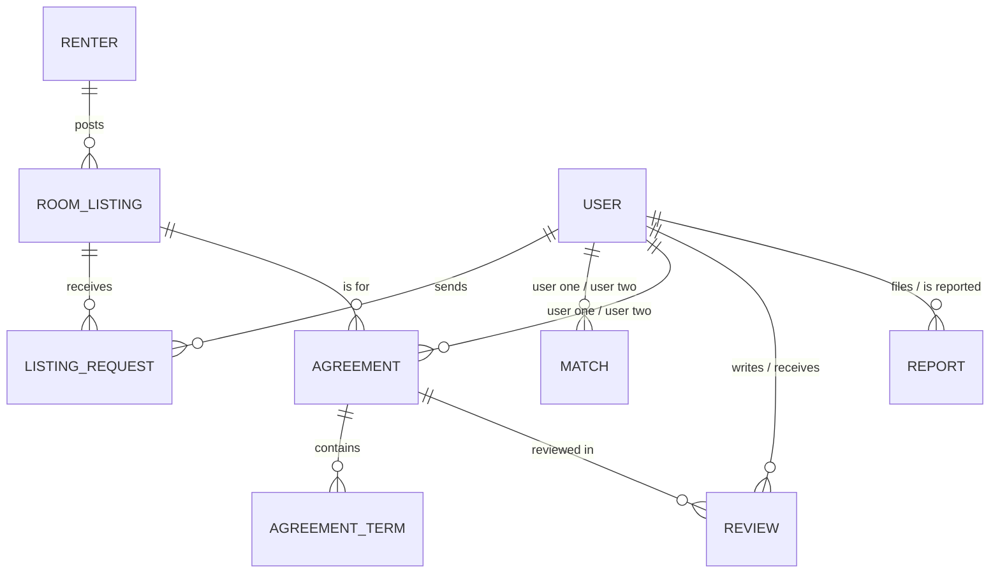
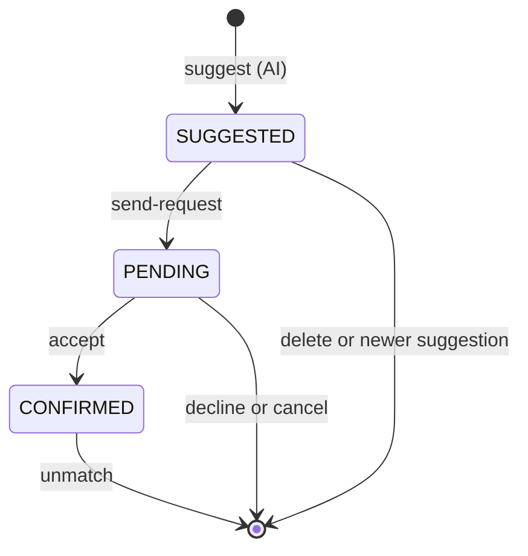

<p align="center">
  
</p>

# Rifqa (رفقة) – Roommate Matching API

Rifqa is a Spring Boot REST API that helps people find compatible roommates. Users create a lifestyle profile and get an AI-suggested roommate from people looking in the same city, then send that person a roommate request. Renters post room listings that users can request to join. Matched roommates write a shared agreement with house rules, review each other when it ends, and can report bad behavior to admins.

> Individual capstone project (Capstone 2).

---

## Table of Contents
- [Features](#features)
- [Tech Stack](#tech-stack)
- [Project Structure](#project-structure)
- [Request Design](#request-design)
- [Data Model](#data-model)
- [Business Rules](#business-rules)
- [AI Matching](#ai-matching)
- [Email Notifications](#email-notifications)
- [API Endpoints](#api-endpoints)
- [Error Handling](#error-handling)
- [Getting Started](#getting-started)
- [Example Requests](#example-requests)
- [Full Lifecycle Test](#full-lifecycle-test)
- [Known Limitations and Future Improvements](#known-limitations-and-future-improvements)

---

## Features

- **User profiles** with lifestyle details: budget, sleep schedule, cleanliness level, smoking, pets, visitors, occupation and bio.
- **Two-sided AI matching**: the AI suggests the most compatible roommate with a score (0–100) and a short explanation. The user sends that person a request, and the other person accepts or declines.
- **Room listings** posted by renters, searchable by city and maximum rent.
- **Listing requests**: users request to join a listing, and the owner accepts or rejects it.
- **Agreements** between matched roommates with a lifecycle (`DRAFT → ACTIVE → TERMINATED`) and house rules (terms) that lock once the agreement is active.
- **Reviews** (1–5 stars) after an agreement ends, plus a user's average rating.
- **Reports** against users, handled by admins.
- **Admin tools**: add admins, verify users and renters, review or dismiss reports.
- **Email notifications** for new roommate requests, accepted matches and accepted listing requests.

---

## Tech Stack

| Layer | Technology |
|---|---|
| Language | Java 17 |
| Framework | Spring Boot 4.1.1 (Spring 7) |
| Persistence | Spring Data JPA, Hibernate 7, MySQL |
| Validation | Jakarta Bean Validation |
| JSON | Jackson 3 (`tools.jackson.*`) |
| Email | Spring Mail (Gmail SMTP) |
| AI | OpenAI-compatible Chat Completions API (`gpt-4o-mini`) via `RestTemplate` |
| Utilities | Lombok |
| Testing | Postman |

---

## Project Structure

```
com.example.capstone2rifqa
├── Api          ApiException, ApiResponse, ControllerAdvice
├── Controller   REST controllers (10)
├── DTO          Request DTOs (11) and the MatchSuggestion response
├── Entity       JPA entities (10) and enums (6)
├── Repository   Spring Data JPA repositories (10)
└── Service      Business logic, AiService, EmailService
```

The code follows a layered design: **Controller → Service → Repository**. Controllers only receive requests and return responses; all validation and business rules live in the services.

---

## Request Design

The API is built so the client only sends what the server truly needs:

| Kind of input | Where it goes | Examples |
|---|---|---|
| IDs of existing records and of the acting user | Path variables | `/update/listingid/{listingId}/renterid/{renterId}` |
| Content the person types | Request body, through a small DTO | message, rating, comment, dates, reason, term text |
| Values the server already knows | Never sent by the client | rent, compatibility score, AI reasoning, the other roommate, status, availability |

- Each entity has one DTO shared by its add and update endpoints, holding only the editable fields.
- Add endpoints build a **new** entity from the DTO, so a client can't overwrite an existing row by sending an `id`.
- The service checks that the acting user owns or belongs to the record (for example, only a listing's owner can edit it). This will be replaced by the logged-in account once Spring Security is added.

---

## Data Model

### Entities

| Entity | Description |
|---|---|
| `User` | A person looking for a roommate, with a lifestyle profile |
| `Renter` | A person who owns rooms and posts listings |
| `Admin` | Platform moderator |
| `RoomListing` | A room posted by a renter |
| `ListingRequest` | A user's request to join a room listing |
| `Match` | A pairing between two users that moves from AI suggestion to request to confirmed match, with an AI score and reasoning |
| `Agreement` | A roommate agreement between two matched users for a listing |
| `AgreementTerm` | A house rule inside an agreement |
| `Review` | A rating one roommate gives the other after an agreement ends |
| `Report` | A complaint filed by one user against another |

### Enums

| Enum | Values |
|---|---|
| `UserStatus` | `LOOKING`, `MATCHED`, `NOT_LOOKING` |
| `SleepSchedule` | `EARLY_BIRD`, `NIGHT_OWL` |
| `MatchStatus` | `SUGGESTED`, `PENDING`, `CONFIRMED` |
| `RequestStatus` | `PENDING`, `ACCEPTED`, `REJECTED` |
| `AgreementStatus` | `DRAFT`, `ACTIVE`, `TERMINATED` |
| `ReportStatus` | `PENDING`, `REVIEWED`, `DISMISSED` |

### Relationships

Relations are stored as plain `Integer` ID fields (for example `renterId`, `listingId`), so MySQL has no foreign-key constraints. The services block or clean up related rows themselves (for example, a listing with agreements can't be deleted).



---

## Business Rules

**Users and renters**
- Emails are unique.
- New users start as `LOOKING` and unverified. New renters start unverified.
- Phone numbers must start with `05` and be 10 digits. Users must be 18–100, and cleanliness is 1–5.
- Passwords need at least 8 characters with an uppercase letter, a lowercase letter, a number and a special character. They are write-only: accepted in requests but never returned.
- Profile updates can't change the password or status. Changing the password needs the correct old password, and the new one must be different.
- A user can only switch their own status between `LOOKING` and `NOT_LOOKING`. `MATCHED` is set by the match flow, and a matched user must unmatch first.
- A renter who still has listings can't be deleted.

**Admins**
- Only an existing admin can add another admin. The first admin is inserted directly in MySQL.
- Only an admin can verify a user or renter, and an account can't be verified twice.
- Only an admin can change a report's status, from `PENDING` to `REVIEWED` or `DISMISSED`, and only once.

**Room listings**
- A listing is created for an existing renter and starts as available.
- Only the owner can update, toggle availability or delete a listing. Updates never change the owner or availability.
- A listing with agreements can't be deleted (it can be marked not available instead). Deleting a listing also deletes its requests.

**Listing requests**
- A user can send only one request per listing, and only to an available listing.
- Only the requester can edit the message (while `PENDING`) or cancel the request.
- Only the listing's owner can accept or reject a request, and only while it is `PENDING`. Accepting emails the requester the renter's contact details.

**Matching**
- Only `LOOKING` users can get suggestions. Candidates are `LOOKING` users in the same city with the same gender, excluding anyone who already has a pending request with the user.
- Each user keeps only their latest suggestion. The old one is removed only after the AI succeeds, so a failed call doesn't lose it.
- Suggestions are private: the suggested person doesn't see them.
- Only the user who got the suggestion can send it as a request. Both users must still be `LOOKING`, and there can't already be a pending request between them.
- Only the receiver can accept or decline. Accepting confirms the match, sets both users to `MATCHED`, removes their other suggestions and requests, and emails both with each other's phone numbers.
- Either user can cancel a request or unmatch. Unmatching sets both back to `LOOKING`, but is blocked while they have a draft or active agreement.



**Agreements and terms**
- An agreement is created from a `CONFIRMED` match by one of its two users, for a listing where one of them has an `ACCEPTED` listing request.
- The roommates are copied from the match and the monthly rent is locked from the listing. Only the dates come from the client.
- Each user can be in only one draft or active agreement at a time.
- The start date can't be in the past, and the end date must be after it.
- Status flow: `DRAFT → ACTIVE → TERMINATED`. Only the two roommates can change an agreement.
- Dates can only be edited while `DRAFT`. Activating requires at least one house rule. Only `ACTIVE` agreements can be terminated. Only `DRAFT` agreements can be deleted, together with their terms.
- Terms can only be added, edited or deleted by the roommates while the agreement is `DRAFT`. They are locked once it becomes active.

**Reviews**
- Reviews are allowed only after the agreement is `TERMINATED`, and only by one of its roommates.
- The reviewed user is always the other roommate (set by the server).
- One review per reviewer per agreement. Only the author can edit or delete it.
- The average rating is rounded to one decimal, and is `0.0` when a user has no reviews.

**Reports**
- Users can't report themselves, and there can be only one pending report per reporter against the same user.
- Only the reporter can edit the reason or withdraw the report, and only while it is `PENDING`. Handled reports are kept as the moderation record.

---

## AI Matching

`POST /api/v1/match/suggest/{userId}`

1. The service loads the user and up to 50 candidates (same city, same gender, `LOOKING`, no pending request with the user).
2. `AiService` sends a prompt to an OpenAI-compatible chat API asking for the single most compatible candidate in JSON format.
3. The response is parsed into a `MatchSuggestion`. The score is kept between 0 and 100 and the reasoning is cut to 1000 characters to fit the database.
4. The service checks that the AI picked someone who was actually in the candidate list.
5. The suggestion is saved as a `SUGGESTED` match and returned with its `matchId`. The user then calls `send-request` with that ID to send it to the suggested person.

**Privacy:** only lifestyle fields (age, occupation, budget, smoker, pets, visitors, cleanliness, sleep schedule, bio) are sent to the AI. Names, emails, phone numbers and passwords never leave the server.

Example response:

```json
{
  "matchId": 7,
  "userId": 1,
  "suggestedUserId": 4,
  "suggestedUserName": "Sara",
  "compatibilityScore": 87.0,
  "aiReasoning": "Both are early birds with similar budgets and high cleanliness levels. Neither smokes, and both prefer few visitors."
}
```

---

## Email Notifications

| Trigger | Recipient | Content |
|---|---|---|
| Roommate request sent | The receiver | Sender's name and compatibility score (no phone number yet) |
| Roommate request accepted | Both users | Roommate's name, phone number and compatibility score |
| Listing request accepted | The requester | Listing title and location, and the renter's name and phone number |

Phone numbers are only shared once both sides have agreed. If an email fails to send, the error is logged and the main action still succeeds.

---

## API Endpoints

Base URL: `http://localhost:8080/api/v1`

**79 endpoints** across 10 controllers.

### User – `/user`
| Method | Endpoint | Description |
|---|---|---|
| GET | `/get` | Get all users |
| GET | `/get/{id}` | Get user by ID |
| GET | `/get-by-city/{city}` | Get users in a city |
| GET | `/get-by-status/{status}` | Get users by status (case-insensitive) |
| POST | `/add` | Register a user |
| PUT | `/update/{id}` | Update profile (no password or status) |
| PUT | `/change-password/{id}` | Change password |
| PUT | `/update-status/userid/{userId}/status/{status}` | Switch between `LOOKING` and `NOT_LOOKING` |
| DELETE | `/delete/{id}` | Delete a user |

### Renter – `/renter`
| Method | Endpoint | Description |
|---|---|---|
| GET | `/get` | Get all renters |
| GET | `/get/{id}` | Get renter by ID |
| POST | `/add` | Register a renter |
| PUT | `/update/{id}` | Update profile (no password) |
| PUT | `/change-password/{id}` | Change password |
| DELETE | `/delete/{id}` | Delete a renter (blocked if they have listings) |

### Admin – `/admin`
| Method | Endpoint | Description |
|---|---|---|
| GET | `/get` | Get all admins |
| GET | `/get/{id}` | Get admin by ID |
| POST | `/add/adminid/{adminId}` | Add an admin (existing admins only) |
| PUT | `/verify-user/adminid/{adminId}/userid/{userId}` | Verify a user |
| PUT | `/verify-renter/adminid/{adminId}/renterid/{renterId}` | Verify a renter |
| PUT | `/update-report-status/adminid/{adminId}/reportid/{reportId}/status/{status}` | Mark a report `REVIEWED` or `DISMISSED` |

### Room Listing – `/room-listing`
| Method | Endpoint | Description |
|---|---|---|
| GET | `/get` | Get all listings |
| GET | `/get/{id}` | Get listing by ID |
| GET | `/get-by-renter/{renterId}` | Get a renter's listings |
| GET | `/get-available-by-city/{city}` | Available listings in a city |
| GET | `/get-available-by-max-rent/{maxRent}` | Available listings up to a rent, cheapest first |
| POST | `/add/renterid/{renterId}` | Add a listing |
| PUT | `/update/listingid/{listingId}/renterid/{renterId}` | Update a listing (owner only) |
| PUT | `/toggle-availability/listingid/{listingId}/renterid/{renterId}` | Switch between available and not available (owner only) |
| DELETE | `/delete/listingid/{listingId}/renterid/{renterId}` | Delete a listing and its requests (owner only, blocked if it has agreements) |

### Listing Request – `/listing-request`
| Method | Endpoint | Description |
|---|---|---|
| GET | `/get` | Get all requests |
| GET | `/get/{id}` | Get request by ID |
| GET | `/get-by-listing/{listingId}` | Requests for a listing |
| GET | `/get-pending-by-listing/{listingId}` | Pending requests for a listing |
| GET | `/get-by-requester/{requesterId}` | Requests sent by a user |
| POST | `/add/listingid/{listingId}/userid/{userId}` | Send a request |
| PUT | `/update/requestid/{id}/userid/{userId}` | Edit the message (requester only, pending only) |
| PUT | `/accept/requestid/{requestId}/renterid/{renterId}` | Accept a request (owner only, sends email) |
| PUT | `/reject/requestid/{requestId}/renterid/{renterId}` | Reject a request (owner only) |
| DELETE | `/delete/requestid/{id}/userid/{userId}` | Cancel a request (requester only) |

### Match – `/match`
| Method | Endpoint | Description |
|---|---|---|
| GET | `/get` | Get all matches |
| GET | `/get/{id}` | Get match by ID |
| GET | `/get-by-user/{userId}` | A user's suggestions, requests and matches |
| GET | `/get-incoming/{userId}` | Pending requests the user has received |
| POST | `/suggest/{userId}` | AI roommate suggestion (saved as `SUGGESTED`) |
| PUT | `/send-request/matchid/{matchId}/userid/{userId}` | Send the suggestion as a request (sends email) |
| PUT | `/accept/matchid/{matchId}/userid/{userId}` | Accept a request (receiver only, sends emails) |
| PUT | `/decline/matchid/{matchId}/userid/{userId}` | Decline a request (receiver only) |
| DELETE | `/delete/matchid/{matchId}/userid/{userId}` | Remove a suggestion, cancel a request or unmatch |

### Agreement – `/agreement`
| Method | Endpoint | Description |
|---|---|---|
| GET | `/get` | Get all agreements |
| GET | `/get/{id}` | Get agreement by ID |
| GET | `/get-by-user/{userId}` | Get a user's agreements |
| GET | `/get-by-listing/{listingId}` | Get agreements for a listing |
| POST | `/add/matchid/{matchId}/listingid/{listingId}/userid/{userId}` | Create a draft agreement |
| PUT | `/update/agreementid/{id}/userid/{userId}` | Edit dates (draft only) |
| PUT | `/activate/agreementid/{id}/userid/{userId}` | `DRAFT → ACTIVE` (needs at least one term) |
| PUT | `/terminate/agreementid/{id}/userid/{userId}` | `ACTIVE → TERMINATED` |
| DELETE | `/delete/agreementid/{id}/userid/{userId}` | Delete with its terms (draft only) |

### Agreement Term – `/agreement-term`
| Method | Endpoint | Description |
|---|---|---|
| GET | `/get` | Get all terms |
| GET | `/get/{id}` | Get term by ID |
| GET | `/get-by-agreement/{agreementId}` | Get an agreement's terms |
| POST | `/add/agreementid/{agreementId}/userid/{userId}` | Add a term (roommates only, draft only) |
| PUT | `/update/termid/{id}/userid/{userId}` | Edit a term (roommates only, draft only) |
| DELETE | `/delete/termid/{id}/userid/{userId}` | Delete a term (roommates only, draft only) |

### Review – `/review`
| Method | Endpoint | Description |
|---|---|---|
| GET | `/get` | Get all reviews |
| GET | `/get/{id}` | Get review by ID |
| GET | `/get-by-user/{userId}` | Reviews a user has received |
| GET | `/get-by-agreement/{agreementId}` | Reviews for an agreement |
| GET | `/get-average-rating/{userId}` | A user's average rating |
| POST | `/add/agreementid/{agreementId}/reviewerid/{reviewerId}` | Review your roommate (terminated agreements only) |
| PUT | `/update/reviewid/{id}/reviewerid/{reviewerId}` | Edit rating and comment (author only) |
| DELETE | `/delete/reviewid/{id}/reviewerid/{reviewerId}` | Delete a review (author only) |

### Report – `/report`
| Method | Endpoint | Description |
|---|---|---|
| GET | `/get` | Get all reports |
| GET | `/get/{id}` | Get report by ID |
| GET | `/get-by-status/{status}` | Reports by status (case-insensitive) |
| GET | `/get-by-reported-user/{reportedUserId}` | Reports against a user |
| POST | `/add/reporterid/{reporterId}/reporteduserid/{reportedUserId}` | Submit a report |
| PUT | `/update/reportid/{id}/reporterid/{reporterId}` | Edit the reason (reporter only, pending only) |
| DELETE | `/delete/reportid/{id}/reporterid/{reporterId}` | Withdraw a report (reporter only, pending only) |

---

## Error Handling

All errors return **HTTP 400** with a single message:

```json
{ "message": "User not found with ID: 99" }
```

`ControllerAdvice` handles four exception types:

| Exception | When it happens | Example message |
|---|---|---|
| `ApiException` | A business rule fails in a service | `Only draft agreements can be edited` |
| `MethodArgumentNotValidException` | A `@Valid` check fails | `Age must be at least 18` |
| `MethodArgumentTypeMismatchException` | Wrong type in the URL, e.g. `/get/abc` | `Invalid value: abc` |
| `HttpMessageNotReadableException` | Broken JSON or an invalid enum value in the body | `Invalid request body, please check your fields and values` |

"Get all" endpoints return an empty list when there is nothing. Filtered endpoints (by city, status, user, listing and so on) return a message instead, for example `This user has no reviews yet`.

Status filters in URLs ignore case. A misspelled status returns the allowed values:

```json
{ "message": "Invalid status: pendng. Allowed values: [PENDING, REVIEWED, DISMISSED]" }
```

---

## Getting Started

### Prerequisites
- Java 17
- Maven
- MySQL 8
- A Gmail account with an App Password (for emails)
- An API key for an OpenAI-compatible chat API (for AI matching)

### 1. Create the database
```sql
CREATE DATABASE rifqa;
```
Tables are created automatically (`spring.jpa.hibernate.ddl-auto=update`).

### 2. Configure `application.properties`
```properties
spring.datasource.url=jdbc:mysql://localhost:3306/rifqa
spring.datasource.username=root
spring.datasource.password=your_mysql_password
spring.jpa.hibernate.ddl-auto=update

# AI
ai.api.url=https://api.openai.com/v1/chat/completions
ai.api.model=gpt-4o-mini
ai.api.key=${AI_API_KEY:}

# Email (Gmail SMTP)
spring.mail.host=smtp.gmail.com
spring.mail.port=587
spring.mail.username=your_email@gmail.com
spring.mail.password=${MAIL_PASSWORD:}
spring.mail.properties.mail.smtp.auth=true
spring.mail.properties.mail.smtp.starttls.enable=true
```

### 3. Set environment variables
Secrets are read from environment variables so they are never committed. In IntelliJ, open **Run → Edit Configurations → Environment variables** and add:
```
AI_API_KEY=your_ai_api_key
MAIL_PASSWORD=your_gmail_app_password
```

### 4. Run
```bash
mvn spring-boot:run
```
The API starts at `http://localhost:8080`.

### 5. Add the first admin
Only an admin can add another admin, so the first one is inserted in MySQL after the tables are created:
```sql
INSERT INTO admin (name, email, password, created_at)
VALUES ('Rifqa Admin', 'admin@rifqa.com', 'Admin@1234', NOW());
```

---

## Example Requests

**Register a user** – `POST /api/v1/user/add`
```json
{
  "name": "Abdullah",
  "email": "abdullah@example.com",
  "password": "Pass@1234",
  "phoneNumber": "0512345678",
  "age": 24,
  "gender": "Male",
  "city": "Riyadh",
  "occupation": "Software Engineer",
  "bio": "Quiet, tidy and works from home.",
  "budget": 2500,
  "smoker": false,
  "hasPets": false,
  "allowsVisitors": true,
  "cleanlinessLevel": 4,
  "sleepSchedule": "EARLY_BIRD"
}
```

**Change a password** – `PUT /api/v1/user/change-password/1`
```json
{
  "oldPassword": "Pass@1234",
  "newPassword": "NewPass@5678"
}
```

**Register a renter** – `POST /api/v1/renter/add`
```json
{
  "name": "Khalid",
  "email": "khalid@example.com",
  "password": "Pass@1234",
  "phoneNumber": "0598765432",
  "city": "Riyadh"
}
```

**Add a room listing** – `POST /api/v1/room-listing/add/renterid/1`
```json
{
  "title": "Furnished room near King Saud University",
  "city": "Riyadh",
  "district": "Al Olaya",
  "rentAmount": 2000,
  "description": "Private room, shared kitchen, internet included."
}
```

**Send a listing request** – `POST /api/v1/listing-request/add/listingid/1/userid/1`
```json
{
  "message": "Hi, I'm interested in this room and can move in next month."
}
```
The message is optional. Send `{}` to request without one.

**Get an AI suggestion** – `POST /api/v1/match/suggest/1` (no body)

**Send the suggestion as a request** – `PUT /api/v1/match/send-request/matchid/1/userid/1` (no body)

**Accept the request** – `PUT /api/v1/match/accept/matchid/1/userid/2` (no body)

**Create an agreement** – `POST /api/v1/agreement/add/matchid/1/listingid/1/userid/1`
```json
{
  "startDate": "2026-11-01",
  "endDate": "2027-10-31"
}
```
The start date can't be in the past, so adjust the dates to your testing day.

**Add a house rule** – `POST /api/v1/agreement-term/add/agreementid/1/userid/1`
```json
{
  "termText": "No guests after 11 PM on weekdays."
}
```

**Review your roommate** – `POST /api/v1/review/add/agreementid/1/reviewerid/1`
```json
{
  "rating": 5,
  "comment": "Clean, respectful and always paid on time."
}
```

**Submit a report** – `POST /api/v1/report/add/reporterid/1/reporteduserid/3`
```json
{
  "reason": "Sent rude messages after I declined."
}
```

**Add an admin** – `POST /api/v1/admin/add/adminid/1`
```json
{
  "name": "Noura",
  "email": "noura@rifqa.com",
  "password": "Admin@5678"
}
```

---

## Full Lifecycle Test

Setup: add two users in the same city with the same gender (users 1 and 2), one renter (renter 1) and one listing (listing 1).

| Step | Who | Request |
|---|---|---|
| 1 | User 1 | `POST /match/suggest/1` → returns `matchId` |
| 2 | User 1 | `PUT /match/send-request/matchid/{matchId}/userid/1` |
| 3 | User 2 | `GET /match/get-incoming/2` → `PUT /match/accept/matchid/{matchId}/userid/2` |
| 4 | User 1 | `POST /listing-request/add/listingid/1/userid/1` |
| 5 | Renter 1 | `PUT /listing-request/accept/requestid/{requestId}/renterid/1` |
| 6 | User 1 | `POST /agreement/add/matchid/{matchId}/listingid/1/userid/1` |
| 7 | User 1 or 2 | `POST /agreement-term/add/agreementid/{agreementId}/userid/1` → `PUT /agreement/activate/agreementid/{agreementId}/userid/1` |
| 8 | User 1 or 2 | `PUT /agreement/terminate/agreementid/{agreementId}/userid/1` |
| 9 | Both | `POST /review/add/agreementid/{agreementId}/reviewerid/1` and `/reviewerid/2` → `GET /review/get-average-rating/2` |
| 10 | User 1 | `DELETE /match/delete/matchid/{matchId}/userid/1` → both users are `LOOKING` again |

### Testing without the AI key
To test the rest of the flow without calling the AI, create a confirmed match directly in MySQL:
```sql
INSERT INTO `match` (user_one_id, user_two_id, compatibility_score, ai_reasoning, status, matched_at)
VALUES (1, 2, 85, 'Test', 'CONFIRMED', NOW());

UPDATE user SET status = 'MATCHED' WHERE id IN (1, 2);
```
Use `'SUGGESTED'` instead (without the `UPDATE`) to test `send-request`.

---

## Known Limitations and Future Improvements

- **Authentication and authorization** with Spring Security and JWT, so the acting user's ID comes from the logged-in account instead of the URL.
- **Password hashing** with BCrypt (passwords are currently stored as plain text).
- **User and renter registration** should use a DTO like the other add endpoints, so a sent `id` can't overwrite an existing account.
- **Deleting a user** should be blocked while they have an active match or agreement, and should clean up their other related rows (there are no foreign-key constraints).
- **Accepting a listing request** should mark the listing as not available and reject the other pending requests.
- **Privacy**: public "get" endpoints return email and phone numbers; response DTOs should hide them.
- Pagination for the "get all" endpoints.
- Unit and integration tests.

---

## Author

Rifqa Capstone 2 project, built with Spring Boot.
